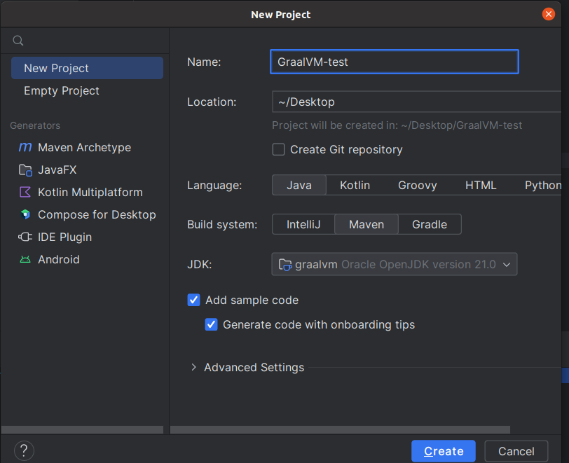
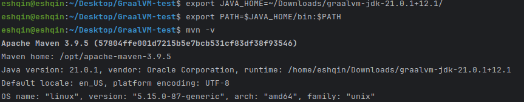
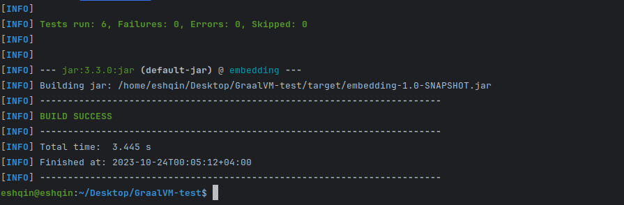
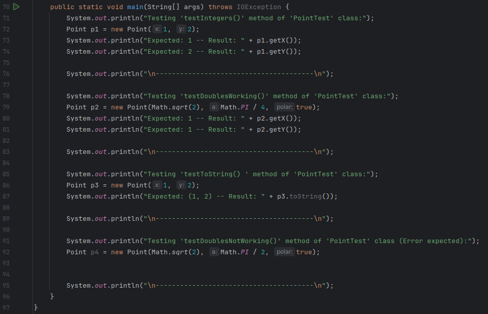
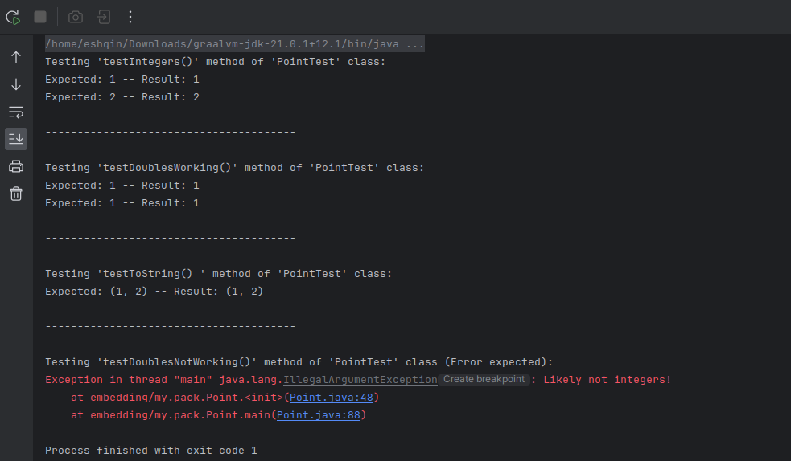
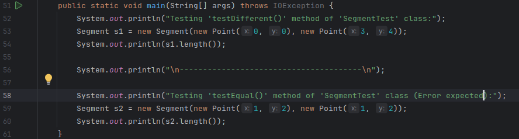
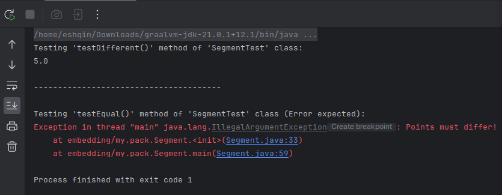
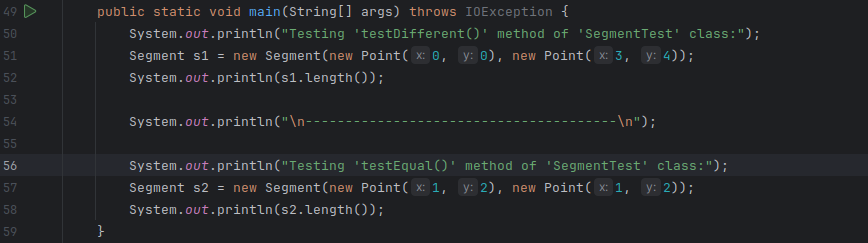
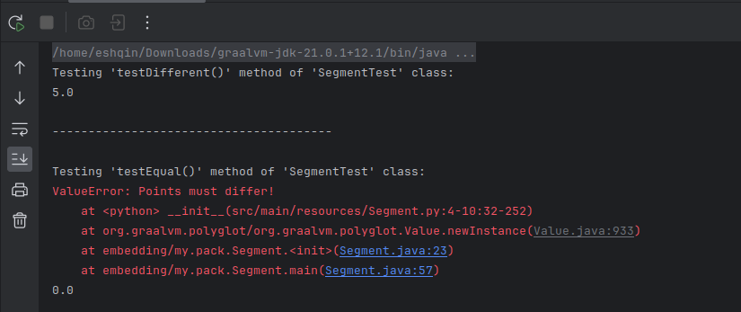

# Java to Python Translation Tasks

## Description

This repository contains solutions to tasks that involve translating Java code to Python using GraalVM. The tasks range from translating individual Java classes to fully functional Java-to-Python translations with tests.

## Prerequisites

Before running the tasks, you'll need the following prerequisites:

- [GraalVM](https://www.graalvm.org/downloads): The GraalVM runtime to execute the Python code. Ensure you have downloaded and unzipped GraalVM Java 21.

- [Maven](https://maven.apache.org/docs/3.8.6/release-notes.html): A build tool for Java projects.

- [IntelliJ IDEA](https://www.jetbrains.com/idea/download/): A popular Integrated Development Environment for Java and Python development.

- Setting JAVA_HOME to the location of GraalVM Java 21:
```bash
    export JAVA_HOME=path-to-graalvm/graalvm-jdk-21.0.1+12.1/ 
    export PATH=$JAVA_HOME/bin:$PATH
```

## Setting Up the Environment

Follow these steps to set up your environment for running the tasks:

1. **Create a New Maven Project with IntelliJ IDEA:**

   - Open IntelliJ IDEA.
   - Click on "File" > "New" > "Project..."
   - Select "Maven" and click "Next."
   - Choose a location for your project and set the "Project SDK" to GraalVM Java 21.
   - Click "Next" and provide a "GroupId" and "ArtifactId" for your project.
   - Click "Finish."

   

2. **Replace Project Folders:**

   - Replace the folders inside the `src/` folder of your newly created project with the corresponding folders inside the `OriginalTaskSrc/` folder. Make sure to replace the project's source code with the task code from `OriginalTaskSrc/` as a starting point.

3. **Replace the `pom.xml` File:**

   - Replace the `pom.xml` file of your project with the one provided in this repository. You can copy the contents of the `pom.xml` from the repository and paste it into your project's `pom.xml` file. After copying `pom.xml`, refresh in order to install dependencies

4. **Build the Project:**

   - In the terminal, navigate to your project's root directory. Run `mvn -v` to make sure it points to GraalVM Java21. <br>
    <br>
   If it does not, consider running the commands below:
```bash
    export JAVA_HOME=path-to-graalvm/graalvm-jdk-21.0.1+12.1/ 
    export PATH=$JAVA_HOME/bin:$PATH
```

   - Run the following command: `mvn package`

   

5. **Run the Tests:**

   - If the build succeeds (you get the result above), you are ready to perform the tests using the provided task solutions.


Now, your environment is set up and ready to run the tasks. You can proceed to run and test the solutions.


## Task 1 - Translate Point.java into Python

To complete Task 1, follow these steps:

1. **Replace the Project's `src/` Folder:**

    - Replace the `src/` folder inside your project directory with the `src/` folder from the `Problem1/Task-5` directory provided in this repository. This will replace the existing Java code with the translated Python code for `Point.java`.

2. **Run the "public static void main":**

    - Since the build process might fail due to compatibility issues between GraalVM and Maven, you can run the tests using the "public static void main" method from your Java code. Because the task asks to update Point.java, I display its result only. <br>
    **Run main method:**
     <br>
    **Result:** <br>
    


## Task 2 - Translate Point and Segment to Python

To complete Task 2, follow these steps:

1. **Replace the Project's `src/` Folder:**

    - Replace the `src/` folder inside your project directory with the `src/` folder from the `Problem2/Task-5` directory provided in this repository. This will replace the existing Java code with the translated Python code for `Point.java` and `Segment.java`.

2. **Run the "public static void main":**

    - Running `Point.java` works the same as before; therefore, I just added the running result of `Segment.java`:
    <br>
    **Run main method:** <br>
     <br>
    **Result:** <br>
    


## Task 3 - Translate Segment.java into Python

To complete Task 3, follow these steps:

1. **Replace the Project's `src/` Folder:**

    - Replace the `src/` folder inside your project directory with the `src/` folder from the `Problem3/Task-5` directory provided in this repository. This will replace the existing Java code with the translated Python code for `Segment.java`.

2. **Run the "public static void main":**

    - Because `Point.java` remains as it is in original. I just test `Segment.java`. `Point.java` in this regard can be tested with unit testing.
    1. Point.java
    <br>
    **Run main method:** <br>
     <br>
    **Result:** <br>
    
